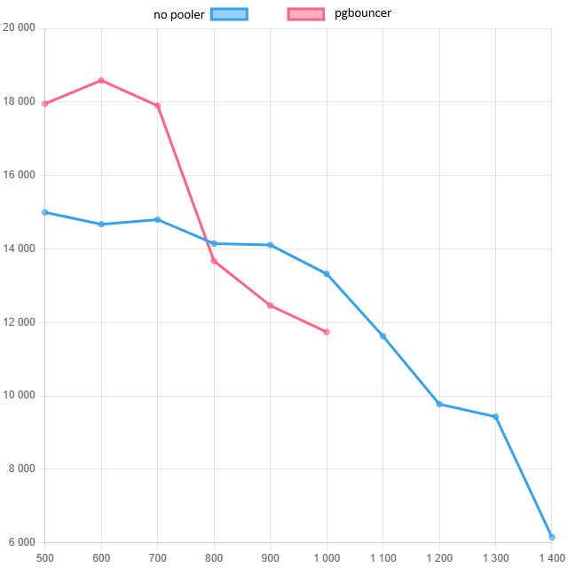
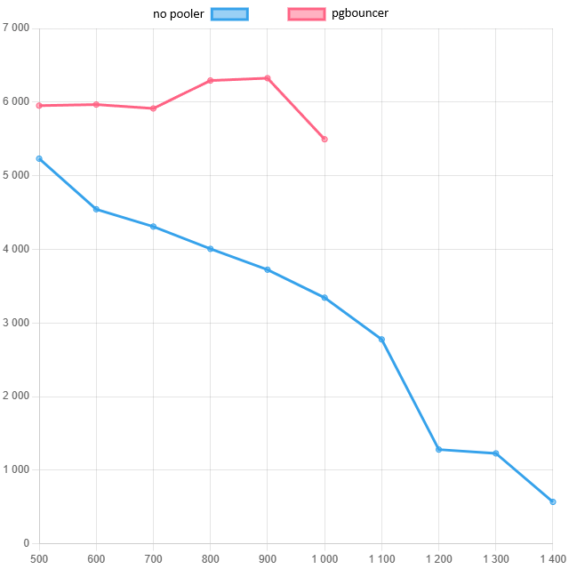
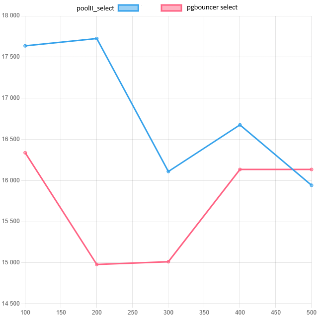
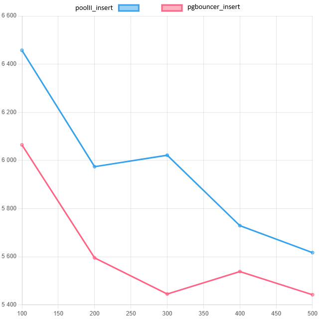

# Домашнее задание 2 (hw2)

## Окружение

- 2 VM
- ОС: RHEL 8
- RAM: 7.5 GiB
- CPU: 4 core

## Конфигурация PostgreSQL и окружения

### 1. Установка PostgreSQL 17.5 на тесте для двух ВМ

На тестовой системе в закрытом DMZ-контуре, так как доступы до репозитория PostgreSQL 17 закрыты, пакеты установлены вручную:

```bash
dnf localinstall postgresql17-17.5-3PGDG.rhel8.x86_64.rpm
dnf localinstall postgresql17-contrib-17.5-3PGDG.rhel8.x86_64.rpm
dnf localinstall postgresql17-devel-17.5-3PGDG.rhel8.x86_64.rpm
dnf localinstall postgresql17-docs-17.5-3PGDG.rhel8.x86_64.rpm
dnf localinstall postgresql17-libs-17.5-3PGDG.rhel8.x86_64.rpm
dnf localinstall postgresql17-pltcl-17.5-3PGDG.rhel8.x86_64.rpm
dnf localinstall postgresql17-server-17.5-3PGDG.rhel8.x86_64.rpm
```

### 2. Проверка swappiness на тесте для двух ВМ

```bash
[root@tdb-txwb2 ~]# cat /proc/sys/vm/swappiness
30
```

### 3. Проверка версии ОС на тесте для двух ВМ

```bash
[root@tdb-txwb2 ~]# sudo cat /proc/version
Linux version 4.18.0-513.9.1.el8_9.x86_64 (mockbuild@x86-vm-09.build.eng.bos.redhat.com) (gcc version 8.5.0 20210514 (Red Hat 8.5.0-20) (GCC)) #1 SMP Thu Nov 16 10:29:04 EST 2023
```

### 4. Проверка HugePages на тесте для двух ВМ

```bash
[root@tdb-txwb2 ~]# grep Huge /proc/meminfo
AnonHugePages:     34816 kB
ShmemHugePages:        0 kB
FileHugePages:         0 kB
HugePages_Total:       0
HugePages_Free:        0
HugePages_Rsvd:        0
HugePages_Surp:        0
Hugepagesize:       2048 kB
Hugetlb:               0 kB
```

### 5. Настройки БД

Рекомендация Cybertec для теста на двух ВМ:

```conf
max_worker_processes = 8
max_connections = 100
shared_buffers = 128MB
max_wal_size = 1GB
min_wal_size = 80MB
fsync = on
synchronous_commit = on
random_page_cost = 4
huge_pages = try
```

Дополнительные настройки:

```conf
shared_buffers = '8192 MB'
work_mem = '32 MB'
maintenance_work_mem = '420 MB'
effective_cache_size = '22 GB'
effective_io_concurrency = 100
random_page_cost = 1.25
```

```conf
# Connectivity
max_connections = 1000
superuser_reserved_connections = 3

# Memory Settings
shared_buffers = '2048 MB'
work_mem = '32 MB'
maintenance_work_mem = '320 MB'
huge_pages = off
effective_cache_size = '6 GB'
effective_io_concurrency = 200
random_page_cost = 1.25

# Monitoring
shared_preload_libraries = 'pg_stat_statements'
track_io_timing = on
track_functions = pl

# Replication
wal_level = replica
max_wal_senders = 0
synchronous_commit = on

# Checkpointing
checkpoint_timeout = '15 min'
checkpoint_completion_target = 0.9
max_wal_size = '1024 MB'
min_wal_size = '512 MB'

# WAL writing
wal_compression = on
wal_buffers = -1
wal_writer_delay = 200ms
wal_writer_flush_after = 1MB

# Background writer
bgwriter_delay = 200ms
bgwriter_lru_maxpages = 100
bgwriter_lru_multiplier = 2.0
bgwriter_flush_after = 0

# Parallel queries
max_worker_processes = 4
max_parallel_workers_per_gather = 2
max_parallel_maintenance_workers = 2
max_parallel_workers = 4
parallel_leader_participation = on

# Advanced features
enable_partitionwise_join = on
enable_partitionwise_aggregate = on
jit = on
max_slot_wal_keep_size = '1000 MB'
track_wal_io_timing = on
maintenance_io_concurrency = 200
wal_recycle = off
```

### 6. Разворачивание БД «тайские авиалинии» среднего размера

```bash
[postgres@tdb-txwb2 ~]$ pg_restore -U postgres -d thai thai.sql
```

## Проверка производительности по заданию

### Проверка SELECT

#### 1. Запрос для тестирования

```bash
[postgres@tdb-txwb2 ~]$ cat workload_select.sql
\set r random(1, 5000000)
SELECT id, fkRide, fio, contact, fkSeat FROM book.tickets WHERE id = :r;
```

#### 2. Локальная нагрузка на БД запросом `workload_select.sql`

```bash
[postgres@tdb-txwb2 ~]$
for i in 500 600 700 800 900 1000 1100 1200 1300 1400 1500; do
echo "connections:" $i
pgbench -c $i -j 4 -T 10 -f ~/workload_select.sql -U postgres -h localhost -p 5432 thai -n | grep -E "latency|tps"
done
```

Результаты:

```text
connections: 500
latency average = 33.351 ms
tps = 14992.110001 (without initial connection time)
connections: 600
latency average = 40.898 ms
tps = 14670.629484 (without initial connection time)
connections: 700
latency average = 47.310 ms
tps = 14795.960872 (without initial connection time)
connections: 800
latency average = 56.560 ms
tps = 14144.237114 (without initial connection time)
connections: 900
latency average = 63.806 ms
tps = 14105.202879 (without initial connection time)
connections: 1000
latency average = 75.073 ms
tps = 13320.340795 (without initial connection time)
connections: 1100
latency average = 94.630 ms
tps = 11624.190205 (without initial connection time)
connections: 1200
latency average = 122.780 ms
tps = 9773.558348 (without initial connection time)
connections: 1300
latency average = 137.838 ms
tps = 9431.371250 (without initial connection time)
connections: 1400
latency average = 227.621 ms
tps = 6150.580272 (without initial connection time)
```

### 3. Установка PgBouncer на другую VM

```bash
[root@TDB-TXWB ~]# dnf localinstall pgbouncer-1.25.2-42PGDG.rhel8.10.x86_64.rpm
```

### 4. Конфигурирование PgBouncer на `10.222.1.61`

```conf
[databases]
thai = host=10.222.1.62 port=5432

[users]

[pgbouncer]
logfile = /var/log/postgresql/pgbouncer.log
pidfile = /var/run/postgresql/pgbouncer.pid
listen_addr = *
listen_port = 6432
unix_socket_dir = /var/run/postgresql
auth_type = scram-sha-256
auth_file = /etc/pgbouncer/userlist.txt
admin_users = postgres
max_client_conn = 2000
default_pool_size = 100
```

### 5. Получение пароля для пользователей PgBouncer

```sql
select * from pg_shadow
```

Пример вывода:

```text
"backup"    "1175956" false false false false "SCRAM-SHA-256$4096:zrthDwiFDdUzoiIyWNJFJg==$PTU/y3n+XMmRSR6TC5nyK1FiT+VQ8yvULcYziAPXKh8=:SLZx1JL/cVXmqo6ye9OmwxvFJrg2CTTDhGdnaiGkh3c="
"postgres"  "10" true true true true "SCRAM-SHA-256$4096:E7o9fRSHYIk8biWij/H7mw==$4X77HU+Fjn7bqfLZv8gfT4TdMZsrA3Ju6MEZv1/NJhY=:QfdxYWQs2ZfD1lSStY3J0A5No5oVL4f8dC/JWEi02ow="
"ppem_agent" "1059785" true true false false "SCRAM-SHA-256$4096:Z4kZFbMPLWbpk81c/QPTkg==$C8oatNSfECJu7m3xu5edeR/GtneabPKQyO7r9D+PTSw=:HiOOFwfk+a146VUGmk7Pn1OSf4PTUMt4ebI7248PPfg="
"test"      "1455183" false false false false
"tx"        "17204" false false false false "SCRAM-SHA-256$4096:w4LnvJfvj+3rtByZBHt1/A==$1QrY1xPDytewkfqk46K9YxvzYlttMCfGCYlG8xleWUo=:S/hj7Ac073hWUeqQCe0L97MiXxcw5gK8ybdST8EkTAs="
```

### 6. Тестирование PgBouncer с VM `10.222.1.61` -> `10.222.1.62`

На тестовых ресурсах более 1000 подключений не обрабатывалось.

```bash
for i in 500 600 700 800 900 1000 1100 1200 1300 1400 1500; do
echo "connections:" $i
pgbench -c $i -j48 -T 20 -f ~/workload_select.sql -U postgres -h 10.222.1.61 -p 6432 thai -n | grep -E "latency|tps"
done
```

Результаты:

```text
connections: 500
latency average = 27.855 ms
tps = 17950.250129 (without initial connection time)
connections: 600
latency average = 32.289 ms
tps = 18582.453894 (without initial connection time)
connections: 700
latency average = 39.115 ms
tps = 17896.002481 (without initial connection time)
connections: 800
latency average = 58.512 ms
tps = 13672.485264 (without initial connection time)
connections: 900
latency average = 46.256 ms
tps = 19456.768482 (without initial connection time)
connections: 1000
latency average = 85.219 ms
tps = 11734.461152 (without initial connection time)
```

## Проверка INSERT

### 1. Скрипт для проверки INSERT

```sql
INSERT INTO book.tickets (fkRide, fio, contact, fkSeat)
VALUES (
    ceil(random()*100),
    (array(SELECT fam FROM book.fam))[ceil(random()*110)]::text || ' ' ||
    (array(SELECT nam FROM book.nam))[ceil(random()*110)]::text,
    ('{"phone":"+7' || (1000000000::bigint + floor(random()*9000000000)::bigint)::text || '"}')::jsonb,
    ceil(random()*100)
);
```

### 2. Проверка INSERT локально

```bash
[postgres@tdb-txwb2 ~]$ for i in 500 600 700 800 900 1000 1100 1200 1300 1400; do
> echo "connections:" $i
> pgbench -c $i -j 4 -T 10 -f ~/workload_insert.sql -U postgres -h localhost -p 5432 thai -n | grep -E "latency|tps"
> done
```

Результаты:

```text
connections: 500
latency average = 95.572 ms
tps = 5231.661888 (without initial connection time)
connections: 600
latency average = 132.035 ms
tps = 4544.263625 (without initial connection time)
connections: 700
latency average = 162.469 ms
tps = 4308.518102 (without initial connection time)
connections: 800
latency average = 199.723 ms
tps = 4005.550381 (without initial connection time)
connections: 900
latency average = 241.746 ms
tps = 3722.918056 (without initial connection time)
connections: 1000
latency average = 299.164 ms
tps = 3342.646727 (without initial connection time)
connections: 1100
latency average = 396.300 ms
tps = 2775.676240 (without initial connection time)
connections: 1200
latency average = 937.993 ms
tps = 1279.327235 (without initial connection time)
connections: 1300
latency average = 1059.225 ms
tps = 1227.312638 (without initial connection time)
connections: 1400
latency average = 2462.755 ms
tps = 568.468959 (without initial connection time)
```

### 3. Проверка PgBench с удаленной VM `10.222.1.61 -> 10.222.1.62`

Уперся в 1000 подключений — больше не обрабатывалось, `pgbench` зависал.

```bash
pgbench -c 500 -j 8 -T 20 -f ~/workload_insert.sql -U postgres -h 10.222.1.61 -p 6432 thai | grep -E "latency|tps"
```

Результаты:

```text
500
latency average = 84.013 ms
tps = 5951.472715 (without initial connection time)
600
latency average = 100.566 ms
tps = 5966.240817 (without initial connection time)
700
latency average = 118.379 ms
tps = 5913.193760 (without initial connection time)
800
latency average = 127.140 ms
tps = 6292.282218 (without initial connection time)
900
latency average = 142.306 ms
tps = 6324.415488 (without initial connection time)
1000
latency average = 181.995 ms
tps = 5494.644173 (without initial connection time)
```

## Сравнение Pgpool-II и PgBench

### Установка Pgpool-II

```bash
dnf localinstall pgpool-II-4.4.2-1.rhel8.x86_64.rpm
```

### Настройки Pgpool-II

```conf
backend_clustering_mode = 'streaming_replication'
port = 6455
unix_socket_directories = '/run/pgpool-II'
backend_hostname0 = '10.222.1.62'
backend_port0 = 5432
backend_data_directory0 = '/postgres/17'
num_init_children = 1000
min_spare_children = 100
max_spare_children = 500
max_pool = 1
pid_file_name = '/run/pgpool-II/pgpool.pid'
sr_check_user = 'postgres'
health_check_user = 'postgres'
health_check_user0 = 'postgres'
hostname0 = ''
```

К сожалению, на моей конфигурации не удалось выжать из Pgpool-II более 500 подключений.

### Сравнение с PgBouncer от 100 до 500 подключений

#### Pgpool-II

**SELECT**

```bash
[postgres@TDB-TXWB ~]$ for i in 100 200 300 400 500; do
> echo "connections:" $i
> pgbench -c $i -j 5 -T 20 -f ~/workload_select.sql -U postgres -h 127.0.0.1 -p 6455 thai -n | grep -E "latency|tps"
> done
```

Результаты:

```text
connections: 100
latency average = 5.670 ms
tps = 17636.332750 (without initial connection time)
connections: 200
latency average = 11.283 ms
tps = 17725.240726 (without initial connection time)
connections: 300
latency average = 18.623 ms
tps = 16109.037622 (without initial connection time)
connections: 400
latency average = 23.987 ms
tps = 16675.627793 (without initial connection time)
connections: 500
latency average = 31.364 ms
tps = 15941.741349 (without initial connection time)
```

**INSERT**

```bash
for i in 100 200 300 400 500; do
echo "connections:" $i
pgbench -c $i -j 5 -T 20 -f ~/workload_insert.sql -U postgres -h 127.0.0.1 -p 6455 thai -n | grep -E "latency|tps"
done
```

Результаты:

```text
connections: 100
latency average = 15.486 ms
tps = 6457.302155 (without initial connection time)
connections: 200
latency average = 33.479 ms
tps = 5973.942008 (without initial connection time)
connections: 300
latency average = 49.822 ms
tps = 6021.463436 (without initial connection time)
connections: 400
latency average = 69.821 ms
tps = 5728.974419 (without initial connection time)
connections: 500
latency average = 89.017 ms
tps = 5616.925382 (without initial connection time)
```

#### PgBouncer

**SELECT**

```bash
[postgres@TDB-TXWB ~]$ for i in 100 200 300 400 500; do
> echo "connections:" $i
> pgbench -c $i -j4 -T 20 -f ~/workload_select.sql -U postgres -h 10.222.1.61 -p 6432 thai -n | grep -E "latency|tps"
> done
```

Результаты:

```text
100
latency average = 6.121 ms
tps = 16337.353567 (without initial connection time)
200
latency average = 13.352 ms
tps = 14979.353508 (without initial connection time)
300
latency average = 19.983 ms
tps = 15012.392893 (without initial connection time)
400
latency average = 24.793 ms
tps = 16133.807949 (without initial connection time)
500
latency average = 24.793 ms
tps = 16133.807949 (without initial connection time)
```

**INSERT**

```bash
[postgres@TDB-TXWB ~]$ for i in 100 200 300 400 500; do
> echo "connections:" $i
> pgbench -c $i -j4 -T 20 -f ~/workload_insert.sql -U postgres -h 10.222.1.61 -p 6432 thai -n | grep -E "latency|tps"
> done
```

Результаты:

```text
connections: 100
latency average = 16.490 ms
tps = 6064.407148 (without initial connection time)
connections: 200
latency average = 35.745 ms
tps = 5595.233455 (without initial connection time)
connections: 300
latency average = 55.095 ms
tps = 5445.108881 (without initial connection time)
connections: 400
latency average = 72.225 ms
tps = 5538.255226 (without initial connection time)
connections: 500
latency average = 91.878 ms
tps = 5442.020825 (without initial connection time)
```
Графики:







Выводы:

1 Пулеры помогают поддерживать tps
2 pg_bouncer чуть более производителен чем pgpool II(или не умею правильно настраивать pgpool II)
3 Думаю что на пуллеры тажке нужно выделять CPU для улучшения производитедьности, не получится сделать пуллер на 4cpu и бд на 16cpu
4 На будущее хотелось бы проверить работу 2х пуллеров: пуллер софтверный(например HikaryPool) + pg_bouncer, как они будут взаимодействовать


